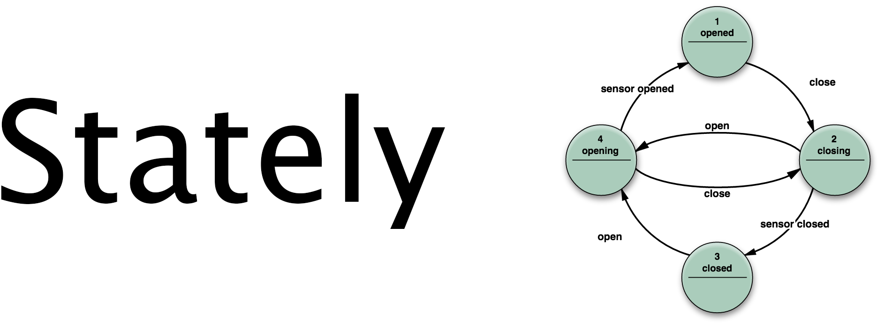

# Stately [](https://raw.githubusercontent.com/softwarenerd/Stately/master/LICENSE.md) [](https://github.com/softwarenerd/Stately/releases) [](https://travis-ci.org/softwarenerd/Stately) 

## Introduction 

[Stately](https://github.com/softwarenerd/Stately) is a pure Swift framework for iOS, macOS, watchOS, and tvOS that implements an event-driven finite-state machine.

For information on finite-state machines, see the Wikipedia article [Finite-state machine](https://en.wikipedia.org/wiki/Finite-state_machine).

## Background

I have used variations of Stately in numerous iOS, macOS and .NET applications, and I've found it to be an invaluable tool. I created this open-source version of it for iOS, macOS, watchOS, and tvOS so that other people can both benefit from it and contribute to it.

### Objective-C Compatibility

At this time, Stately cannot be used with Objective-C projects. I decided that it makes the most sense to share Stately as a pure Swift framework. If it becomes clear that Objective-C compatibility is needed, I will add it.

## Quick Links

- [Getting Started](#getting-started)
- [Basic Documentation](#basic-documentation)
- [Example Project](#example-project)
- [Contributing](#contributing)
- [License](#license)

## Getting Started

Stately can be used via [Carthage](https://github.com/Carthage/Carthage). 

There are excellent [Insructions](https://github.com/Carthage/Carthage#getting-started) available on the [Carthage](https://github.com/Carthage/Carthage) site, which are summarized below.

#### Add Stately to your Cartfile

```
github "softwarenerd/Stately"
```

#### Update Carthage

```sh
carthage update
```

This will fetch dependencies into a `Carthage/Checkouts` folder, then build each one.

#### Using Stately - macOS

On your application targets’ “General” settings tab, in the “Embedded Binaries” section, drag and drop the Stately.framework file from the [Carthage/Build/Mac][] folder on disk.

Additionally, you'll need to copy debug symbols for debugging and crash reporting on OS X.

#### Using Stately - iOS, tvOS, watchOS

1. On your application targets’ “General” settings tab, in the “Linked Frameworks and Libraries” section, drag and drop Stately.framework you want to use from the appropriate [Carthage/Build][] folder on disk.
1. On your application targets’ “Build Phases” settings tab, click the “+” icon and choose “New Run Script Phase”. Create a Run Script in which you specify your shell (ex: `bin/sh`), add the following contents to the script area below the shell:

  ```sh
  /usr/local/bin/carthage copy-frameworks
  ```

  and add the paths to the frameworks you want to use under “Input Files”, e.g.:

  ```
  $(SRCROOT)/Carthage/Build/iOS/Stately.framework
  ```

  This script works around an [App Store submission bug](http://www.openradar.me/radar?id=6409498411401216) triggered by universal binaries and ensures that necessary bitcode-related files and dSYMs are copied when archiving.

With the debug information copied into the built products directory, Xcode will be able to symbolicate the stack trace whenever you stop at a breakpoint.

When archiving your application for submission to the App Store or TestFlight, Xcode will also copy these files into the dSYMs subdirectory of your application’s `.xcarchive` bundle.

## Basic Documentation

Using [Stately](https://github.com/softwarenerd/Stately) is easy and straightforward.

```swift
var stateClosed: State!
var stateOpened: State!
var eventOpen: Event!
var eventClose: Event!
var stateMachine: StateMachine!

do {
    // Define the states that the state machine can be in.
    stateClosed = try State(name: "Closed") { (object: AnyObject?) -> StateChange? in
        // Log.
        print("Closed")

        // Return, leaving state unchanged.
        return nil
    }
    stateOpened = try State(name: "Opened") { (object: AnyObject?) -> StateChange? in
        // Log.
        print("Opened")

        // Return, leaving state unchanged.
        return nil
    }

    // Define the events that can be sent to the state machine.
    eventOpen  = try Event(name: "Open",   transitions: [(fromState: stateClosed, toState: stateOpened)])
    eventClose = try Event(name: "Close",  transitions: [(fromState: stateOpened, toState: stateClosed)])

    // Initialize the state machine.
    stateMachine = try StateMachine(name: "Door",
                                    defaultState: stateClosed,
                                    states: [stateClosed, stateOpened],
                                    events: [eventClose, eventOpen])

    // Fire events to the state machine.
    stateMachine.fireEvent(event: eventOpen)
    stateMachine.fireEvent(event: eventClose)
} catch {
    // Handle errors.
}
```

## Example Project

The [StatelyExample](https://github.com/softwarenerd/StatelyExample) project provides a comprehensive example of using Stately to build a garage door simulator.

## Contributing

Stately is a work in progress and your contributions are most welcome. Feel free to fork the repo and submit PR's.

## License

Stately is released under the [MIT License](LICENSE.md).
